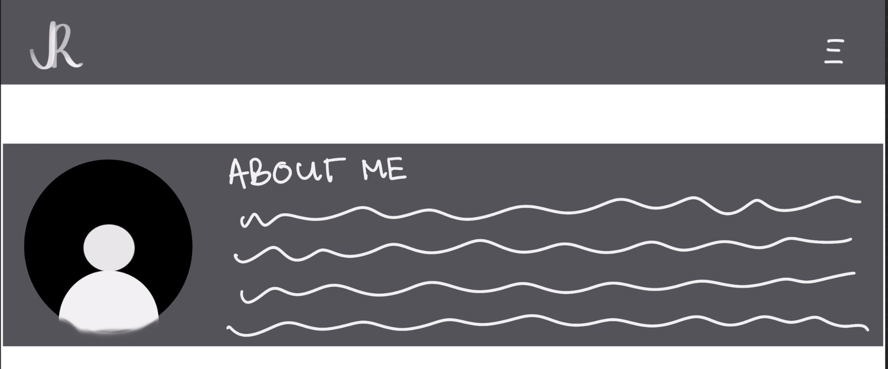
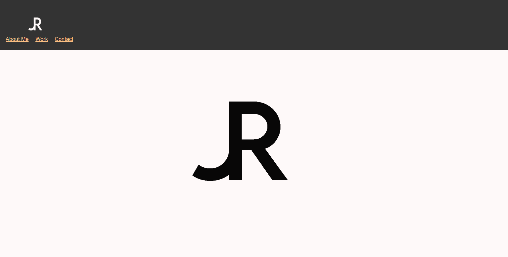
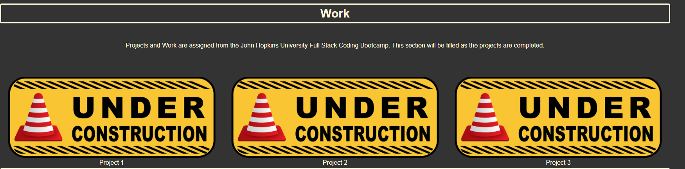

<h1>Portfolio</h1>

## Usage

This homework did not come with a starter code and therefore had to be started from scratch. I utilized Homework 1 <i>(see horiseon-accessibility repository)</i> for the framework of the HTML and CSS.

Then I drafted a Mock Up of how I want my page to look like. 

 *As an example this is how I wanted my About Me Section to look like with the header frozen in display*

#### Mock Up Sample



Originally I wanted to use a hamburger style Nav drop down menu but decided it was not as stated in the Acceptance Criteria and after discussion with my tutor, Kris Renaldi, the work in order to get that done required more knowledge. The hamburger drop down bar will be something I work towards on the next iteration of the portfolio.

### User Story

*AS AN employer
I WANT to view a potential employee's deployed portfolio of work samples
SO THAT I can review samples of their work and assess whether they're a good candidate for an open position*

#### Acceptance Criteria

```
GIVEN I need to sample a potential employee's previous work
WHEN I load their portfolio
THEN I am presented with the developer's name, a recent photo, and links to sections about them, their work, and how to contact them
WHEN I click one of the links in the navigation
THEN the UI scrolls to the corresponding section
WHEN I click on the link to the section about their work
THEN the UI scrolls to a section with titled images of the developer's applications
WHEN I am presented with the developer's first application
THEN that application's image should be larger in size than the others
WHEN I click on the images of the applications
THEN I am taken to that deployed application
WHEN I resize the page or view the site on various screens and devices
THEN I am presented with a responsive layout that adapts to my viewport
```

## Welcome Screen



Acceptance Criteria expanded:

- I decided to go with the logo on the welcome screen instead of jumping into the about me becasue I aesthetically liked websites which did that. I thought it was a way to create the portfolio as my own.

The work section states under consturction because there are currently no applications that are avaible to browse through. This will be updated as projects come along and applications are launched.  

- per the Acceptance Criteria the Under Construction portions are scaled 1.5 when they are hovered upon. 
  
  - WHEN clicked, they lead to a blank page, these pages will be filled with applications when applications are available.

- 

## Credits

- Used W3schools as a reference guide for CSS styling codes

- Drop down button coding got from W3 schools

- Received tutoring from Kris Renaldi on 1 Mar 21